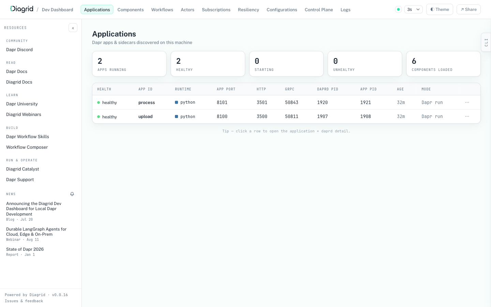
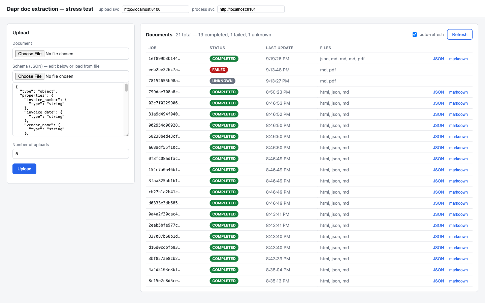
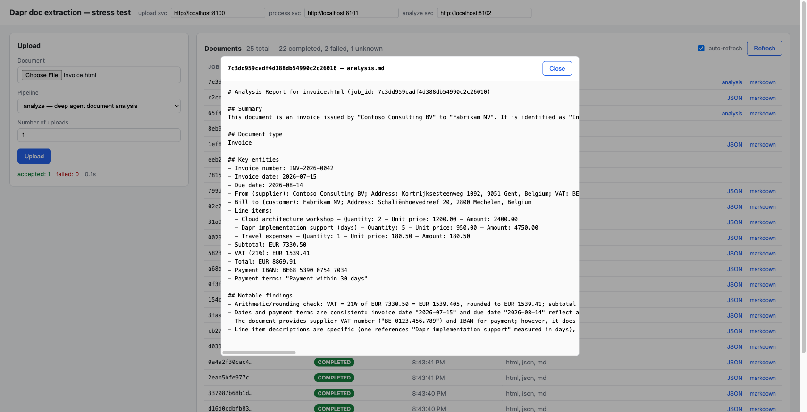

# Dapr document extraction

Three Dapr services that extract or analyze document content, with all LLM work running inside **Dapr Workflows**:

- **upload** (port 8100) — accepts a document via `POST /upload` plus a `pipeline` choice (`extract`, the default, requires a JSON schema; `analyze` does not), stores the document in blob storage (Azurite locally) through the Dapr `blobstore` binding, and publishes a message on the chosen pipeline's topic.
- **analyze** (port 8102) — subscribes to `analyze-topic` and runs a **LangChain deep agent** ([deepagents](https://github.com/langchain-ai/deepagents)) as a durable Dapr Workflow via `DaprWorkflowDeepAgentRunner`: every LLM turn and tool call executes as a workflow activity, so the agent run is retried, checkpointed, and resumes after a crash. The agent reads the document with a `read_document` tool (MarkItDown conversion, paged), writes `analysis.md` with a `save_analysis` tool, and the workflow instance id equals the job id. See [Deep agent analysis pipeline](#deep-agent-analysis-pipeline).
- **process** (port 8101) — subscribes to `process-topic` and runs a code-defined Dapr Workflow (instance id = job id) with six retryable activities:
  1. `retrieve_document` — verify the original document is retrievable via the blob binding (returns only its size)
  2. `convert_to_markdown` — local conversion with [MarkItDown](https://github.com/microsoft/markitdown) (pdf, docx, pptx, xlsx, html, ...); writes `converted.md` to blob storage and returns the blob name
  3. `plan_chunks` — split the markdown into chunk blobs if it exceeds the extraction token budget (usually a no-op returning the single markdown blob)
  4. `extract_structured` — OpenAI structured outputs (`json_schema` response format) using the uploaded schema; fans out in parallel, one call per chunk, when the document was split
  5. `merge_extractions` — combine the partial JSONs into one schema-conforming result (only runs for chunked documents)
  6. `write_results` — write `extracted.json` back to blob storage

```text
          1. POST /upload (file [+ schema] [+ pipeline])
client ------------------------------------> upload (:8100)
                                               |        |
                    2. store original.{ext}    |        |  3. publish {job_id, doc_blob, ...}
                                               v        v
                                 Azurite blob        Redis pub/sub
                                 storage             process-topic | analyze-topic
                                 documents/               |               |
                                 {job_id}/                | 4. subscribe -> schedule workflow
                                      ^                   v               v
                                      |              process (:8101)   analyze (:8102)
                                      |              code-defined      deep agent wrapped by
                                      |              Dapr Workflow     DaprWorkflowDeepAgentRunner
                                      |                   |               |
                                      +-------------------+---------------+
                                        5. read original; write converted.md,
                                           chunks/*.md, extracted.json / analysis.md

client <---- 6. GET :8101/status|/jobs|/result|/markdown  ·  :8102/status|/analysis

extract workflow:  retrieve_document -> convert_to_markdown -> plan_chunks
                     -> extract_structured (parallel, one per chunk) -> merge_extractions -> write_results
analyze workflow:  deep agent loop (plan -> read_document ... -> save_analysis),
                     every LLM turn / tool call = one durable workflow activity
```

Blob layout per job: `documents/{job_id}/original.{ext}`, `documents/{job_id}/converted.md`, then per pipeline `documents/{job_id}/extracted.json` (+ `chunks/chunk-NNN.md` for split documents) or `documents/{job_id}/analysis.md`.

## Prerequisites

- **Docker** — runs Azurite, plus the Redis and placement containers that `dapr init` creates
- **[Dapr CLI](https://docs.dapr.io/getting-started/install-dapr-cli/)** — `brew install dapr/tap/dapr-cli` on macOS (see the link for Linux/Windows)
- **[uv](https://docs.astral.sh/uv/)** — manages the Python environments; it reads `.python-version` and downloads Python 3.12 automatically, so no separate Python install is needed
- **An OpenAI API key**

## Run

From zero to a running system:

```bash
# 1. clone the repo
git clone https://github.com/gbaeke/dapr-workflow.git
cd dapr-workflow

# 2. initialize Dapr (one-time; Docker must be running).
#    Sets up the Redis container used for pub/sub and workflow state.
dapr init

# 3. add your OpenAI API key (both LLM-calling services need one)
cp process/.env.example process/.env
cp analyze/.env.example analyze/.env
#    then edit both .env files:
#    OPENAI_API_KEY=sk-...
#    OPENAI_MODEL=gpt-5-mini   # optional, this is the default

# 4. start Azurite (local blob storage emulator)
docker compose up -d

# 5. start both services + Dapr sidecars
#    (first run: uv creates the virtualenvs and installs dependencies automatically)
dapr run -f dapr.yaml
```

## Diagrid Dev Dashboard (optional)

The free [Diagrid Dev Dashboard](https://docs.diagrid.io/develop/local-development/dev-dashboard/) gives a live view of everything Dapr running locally — very handy for inspecting the `doc_processing_wf` workflow executions in this project.

```bash
# install (macOS/Linux; installs to ~/.local/bin)
curl -sSL https://raw.githubusercontent.com/diagridio/dev-dashboard/main/scripts/install.sh | sh

diagrid-dev-dashboard        # opens http://localhost:9090
```



No configuration needed: both apps started by `dapr run -f dapr.yaml` are discovered automatically, and workflow data is read straight from the local Redis state store. Useful views for this project:

- **Workflows** — list `doc_processing_wf` executions (instance id = job id), inspect the event history per activity, view input/output payloads, and terminate or purge stuck instances
- **Apps** — health, ports, and metadata of the `upload` and `process` apps
- **Components / Subscriptions** — the `blobstore`, `pubsub`, and `statestore` components and the `process-topic` subscription
- **Logs** — live sidecar and app logs with filtering

## Try it

```bash
# structured extraction (default pipeline)
curl -F "file=@sample/invoice.html" -F "schema=<sample/schema.json" http://localhost:8100/upload
# -> {"job_id": "...", "pipeline": "extract", "status_url": "http://localhost:8101/status/..."}

curl http://localhost:8101/status/<job_id>
# -> {"status": "COMPLETED", "output": {"markdown_blob": ..., "result_blob": ...}, ...}

# deep agent analysis (no schema needed)
curl -F "file=@sample/invoice.html" -F "pipeline=analyze" http://localhost:8100/upload
# -> {"job_id": "...", "pipeline": "analyze", "status_url": "http://localhost:8102/status/..."}

curl http://localhost:8102/status/<job_id>     # workflow status of the agent run
curl http://localhost:8102/analysis/<job_id>   # the analysis.md report when completed
```

## Deep agent analysis pipeline

The `analyze` service shows how to host a **LangChain deep agent** inside Dapr Workflow instead of defining the steps in code. The agent is a stock [deepagents](https://github.com/langchain-ai/deepagents) agent (planning/todo tool, subagents, virtual filesystem) with two custom tools; `DaprWorkflowDeepAgentRunner` from the [`diagrid`](https://pypi.org/project/diagrid/) package wraps its compiled LangGraph graph so that **every LLM turn and every tool call runs as a Dapr Workflow activity** — the same durability the extract pipeline gets from hand-written activities, but for an autonomous agent loop:

```python
agent = create_deep_agent(model="openai:gpt-5-mini", tools=[read_document, save_analysis], ...)
runner = DaprWorkflowDeepAgentRunner(agent=agent, name="doc-analysis-agent", max_steps=25)
runner.run_async(input={"messages": [...]}, thread_id=job_id, workflow_id=job_id)
```

Key points (see `analyze/agent.py` and `analyze/app.py`):

- **No LangGraph checkpointer** — durability comes from the workflow engine (event-sourced history in the Redis state store), not framework checkpoints. Kill the analyze service mid-run and restart `dapr run -f dapr.yaml`: the agent resumes from the last completed step instead of starting over. The run also appears in the Diagrid Dev Dashboard like any other workflow.
- **workflow instance id = job id** — duplicate pub/sub deliveries are acked as "already exists", the same idempotency trick the process service uses.
- **Tools are idempotent** because activities run at-least-once: `read_document` converts with MarkItDown once and caches `converted.md`; repeated `save_analysis` calls overwrite the same blob. Tool results travel through activity payloads (4 MiB sidecar cap), so `read_document` returns the document in pages of at most 80k characters.
- The `diagrid` package is a pre-1.0 wrapper (v0.4.x); the durability layer beneath it (`dapr-ext-workflow`, `dapr-ext-langgraph`) is Apache-2.0 Dapr code, and everything runs on plain open-source Dapr — no hosted services involved.

## Test UI



`ui/index.html` is a single-file stress-test UI: pick a document, choose the pipeline (**extract** with an editable schema, prefilled with the sample invoice schema, or **analyze** for the deep agent), choose how many parallel uploads to fire (1–500), and watch jobs complete in the documents table (auto-refresh, view extracted JSON / analysis report / converted markdown per job). Open it with the VS Code built-in browser or any static server — all services allow all CORS origins for local dev. The service base URLs are editable in the header (persisted in localStorage) in case VS Code server forwards the ports under different addresses.



Supporting endpoints on the process service: `GET /jobs` (blob inventory + workflow status per job), `GET /result/{job_id}`, `GET /markdown/{job_id}`.

Fetch a result through the Dapr binding (any sidecar works):

```bash
curl -s -X POST http://localhost:3500/v1.0/bindings/blobstore \
  -H 'Content-Type: application/json' \
  -d '{"operation": "get", "metadata": {"blobName": "<job_id>/extracted.json"}}'
```

## Notes

- **Schemas and strict mode**: the extraction first tries OpenAI strict structured outputs. Strict mode requires `additionalProperties: false` on every object and every property listed in `required` (see `sample/schema.json`). If the schema doesn't satisfy those rules, the service automatically falls back to non-strict `json_schema` mode.
- **Big documents**: if the converted markdown exceeds the extraction token budget (`EXTRACT_MAX_TOKENS`, default 200k), a `plan_chunks` activity splits it into chunk blobs, the workflow fans out one `extract_structured` per chunk in parallel (`when_all`), and a `merge_extractions` activity combines the partial JSONs into one schema-conforming result. The full Odyssey (305k tokens) processes as 2 chunks + merge in ~2.5 minutes.
- **Reliability**: every workflow step runs with a retry policy (3 attempts, exponential backoff). If the process service crashes mid-job, restarting `dapr run -f dapr.yaml` resumes the workflow from the last completed activity. Duplicate pub/sub deliveries are acked because the workflow instance id equals the job id.
- **Document size**: activities pass **blob references** between steps, never document content — `convert_to_markdown` writes `converted.md` to storage itself and returns only the blob name. Workflow state (and the gRPC work items built from it) stays tiny regardless of document size. (Earlier versions passed base64 content through workflow state; a 1.7 MB PDF pushed the replay history past the 4 MB gRPC message limit and wedged the worker — hence this design.)
- **Azurite**: the `blobstore` component points at `http://127.0.0.1:10000` with the well-known `devstoreaccount1` dev credentials; the `documents` container is created automatically.
